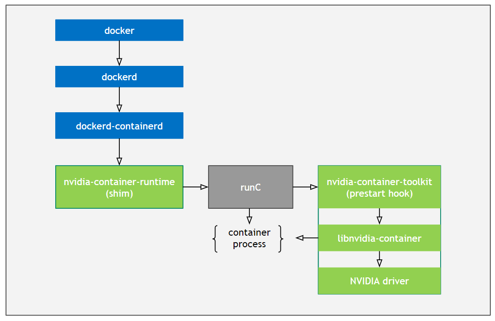

## GPU-Operator

#### 官方代码仓库

- GitHub: https://github.com/NVIDIA/gpu-operator
- GitLab: https://gitlab.com/nvidia/kubernetes/gpu-operator

#### 官方文档

- https://docs.nvidia.com/datacenter/cloud-native/gpu-operator/getting-started.html#install-nvidia-gpu-operator


#### K8s Runtime 架构图


#### GPU-Operator Runtime 架构图



#### 组件

```
├─ nvidia-docker2
│    ├─ docker-ee (>= 18.06.0~ce~3-0~ubuntu)
│    ├─ docker.io (>= 18.06.0)
│    └─ nvidia-container-runtime (>= 3.3.0)
|        └─ nvidia-container-toolkit (<< 2.0.0)
|             └─ libnvidia-container-tools (<< 2.0.0)
│		          └─ libnvidia-container1 (>= 1.2.0~rc.3)
```

###### `nvidia-docker2`

- docker-specific package of the hierarchy
-  takes the script associated with the `nvidia-container-runtime` and installs it into docker’s `/etc/docker/daemon.json` file. 

###### `nvidia-container-runtime`

- takes a `runC` spec as input, injects the `nvidia-container-toolkit` script as a `prestart hook` into it, and then calls out to the native `runC`, passing it the modified `runC` spec with that hook set.

###### `nvidia-container-toolkit`

- a script that implements the interface required by a `runC` `prestart` hook

- takes information contained in the `config.json` and uses it to invoke the `libnvidia-container` CLI with an appropriate set of flags. 

###### `libnvidia-container`

- a simple CLI utility to automatically configure GNU/Linux containers leveraging NVIDIA GPUs

#### 组件仓库

- [nvidia-docker2](https://github.com/NVIDIA/nvidia-docker/tree/gh-pages/)

- [nvidia-container-toolkit](https://github.com/NVIDIA/nvidia-container-runtime/tree/gh-pages/)

- [libnvidia-container](https://github.com/NVIDIA/libnvidia-container/tree/gh-pages/)

#### 安装说明

##### 前提条件

在安装operator之前，请配置好安装环境如下：

1. 所有节点**不需要**预先安装NVIDIA组件(driver, container runtime, device plugin)；

2. 所有节点必须配置Docker , `cri-o`, 或者 `containerd`. 对于doker来说，可以参考[这里](https://docs.docker.com/engine/install/)；

3. 如果使用HWE内核(e.g. kernel 5.x) 的·Ubuntu 18.04 LTS环境下,需要给 `nouveau driver` 添加黑名单，需要更新 `initramfs`；`cpu`型号为`Broadwell`:

   ```
   $ sudo vim /etc/modprobe.d/blacklist.conf
   blacklist nouveau
   options nouveau modeset=0
   $ sudo update-initramfs -u
   $ reboot
   $ lsmod | grep nouveau # 验证nouveau是否已禁用
   ```

   ```
   $ cat /proc/cpuinfo | grep name | cut -f2 -d: | uniq -c  #本文测试时cpu型号为Broadwell
   16 Intel Core Processor (Broadwell)
   ```

4. 节点发现(NFD) 需要在每个节点上配置，默认情况会直接安装，如果已经配置，请在 `Helm chart `变量设置`nfd.enabled` 为 `false` , 再安装;

5. 如果使用Kubernetes 1.13和1.14, 需要激活 [KubeletPodResources](https://kubernetes.io/docs/reference/command-line-tools-reference/feature-gates/)；

   

##### 支持的linux版本

支持的linux版本如下：

| OS Name / Version    | Identifier  | amd64 / x86_64 | ppc64le | arm64 / aarch64 |
| -------------------- | ----------- | -------------- | ------- | --------------- |
| Amazon Linux 1       | amzn1       | X              |         |                 |
| Amazon Linux 2       | amzn2       | X              |         |                 |
| Amazon Linux 2017.09 | amzn2017.09 | X              |         |                 |
| Amazon Linux 2018.03 | amzn2018.03 | X              |         |                 |
| Open Suse Leap 15.0  | sles15.0    | X              |         |                 |
| Open Suse Leap 15.1  | sles15.1    | X              |         |                 |
| Debian Linux 9       | debian9     | X              |         |                 |
| Debian Linux 10      | debian10    | X              |         |                 |
| Centos 7             | centos7     | X              | X       |                 |
| Centos 8             | centos8     | X              | X       | X               |
| RHEL 7.4             | rhel7.4     | X              | X       |                 |
| RHEL 7.5             | rhel7.5     | X              | X       |                 |
| RHEL 7.6             | rhel7.6     | X              | X       |                 |
| RHEL 7.7             | rhel7.7     | X              | X       |                 |
| RHEL 8.0             | rhel8.0     | X              | X       | X               |
| RHEL 8.1             | rhel8.1     | X              | X       | X               |
| RHEL 8.2             | rhel8.2     | X              | X       | X               |
| Ubuntu 16.04         | ubuntu16.04 | X              | X       |                 |
| Ubuntu 18.04         | ubuntu18.04 | X              | X       | X               |
| Ubuntu 20.04         | ubuntu20.04 | X              | X       | X               |

##### 容器运行时

支持的容器运行时：

| OS Name / Version    | amd64 / x86_64 | ppc64le | arm64 / aarch64 |
| -------------------- | -------------- | ------- | --------------- |
| Docker 18.09         | X              | X       | X               |
| Docker 19.03         | X              | X       | X               |
| RHEL/CentOS 8 podman | X              |         |                 |
| CentOS 8 Docker      | X              |         |                 |
| RHEL/CentOS 7 Docker | X              |         |                 |

##### 配置doker环境

参考[这里](https://docs.docker.com/engine/install/)

##### 安装 NVIDIA Container Toolkit

配置`stable` 仓库 和GPG key:

```
$ distribution=$(. /etc/os-release;echo $ID$VERSION_ID) \
   && curl -s -L https://nvidia.github.io/nvidia-docker/gpgkey | sudo apt-key add - \
   && curl -s -L https://nvidia.github.io/nvidia-docker/$distribution/nvidia-docker.list | sudo tee /etc/apt/sources.list.d/nvidia-docker.list
```

更新软件仓库后安装`nvidia-docker2`:

```
$ sudo apt-get update
```

```shell
$ sudo apt-get install -y nvidia-docker2
-----
   What would you like to do about it ?  Your options are:
    Y or I  : install the package maintainer's version
    N or O  : keep your currently-installed version
      D     : show the differences between the versions
      Z     : start a shell to examine the situation
-----
chooses "N" if you have custom settings, the configuration below will override your settings.
{
    "runtimes": {
        "nvidia": {
            "path": "/usr/bin/nvidia-container-runtime",
            "runtimeArgs": []
        }
    }
}
```

重启`docker`

```
$ sudo systemctl restart docker
```

##### [自定义环境变量 (OCI spec)](https://docs.nvidia.com/datacenter/cloud-native/container-toolkit/user-guide.html#environment-variables-oci-spec)

#### 安装NVIDIA GPU Operator

##### 安装Helm

```
$ curl -fsSL -o get_helm.sh https://raw.githubusercontent.com/helm/helm/master/scripts/get-helm-3 \
   && chmod 700 get_helm.sh \
   && ./get_helm.sh
```

添加`NVIDIA Helm`仓库

```
$ helm repo add nvidia https://nvidia.github.io/gpu-operator \
   && helm repo update
```

##### 安装 GPU Operator

###### docker as runtime

```
$ kubectl create ns gpu-operator-resources
$ helm install gpu-operator nvidia/gpu-operator -n gpu-operator-resources --wait
```

如果需要指定驱动版本，可参考如下：

```
$ helm install gpu-operator nvidia/gpu-operator -n gpu-operator-resources \
--set driver.version="450.80.02"
```

###### crio as runtime

```
helm install gpu-operator nvidia/gpu-operator -n gpu-operator-resources\
   --set operator.defaultRuntime=crio
```

###### containerd as runtime

```
helm install gpu-operator nvidia/gpu-operator -n gpu-operator-resources\
   --set operator.defaultRuntime=containerd
```

```
Furthermore, when setting containerd as the defaultRuntime the following options are also available:

toolkit:
  env:
  - name: CONTAINERD_CONFIG
    value: /etc/containerd/config.toml
  - name: CONTAINERD_SOCKET
    value: /run/containerd/containerd.sock
  - name: CONTAINERD_RUNTIME_CLASS
    value: nvidia
  - name: CONTAINERD_SET_AS_DEFAULT
    value: true
```

**如果安装过程中出现超时，请检查你的镜像是否在拉取中**！

##### [考虑无缝安装](https://docs.nvidia.com/datacenter/cloud-native/gpu-operator/getting-started.html#considerations-to-install-in-air-gapped-clusters)

##### 使用 `values.yaml`安装

```
$ helm install gpu-operator nvidia/gpu-operator -n gpu-operator-resources -f values.yaml
```

#### 检查已部署operator服务状态

##### 检查pods

```
$ kubectl get pods -n gpu-operator-resources
NAME                                                          READY   STATUS      RESTARTS   AGE
gpu-feature-discovery-4gk78                                   1/1     Running     0          35s
gpu-operator-858fc55fdb-jv488                                 1/1     Running     0          2m52s
gpu-operator-node-feature-discovery-master-7f9ccc4c7b-2sg6r   1/1     Running     0          2m52s
gpu-operator-node-feature-discovery-worker-cbkhn              1/1     Running     0          2m52s
gpu-operator-node-feature-discovery-worker-m8jcm              1/1     Running     0          2m52s
nvidia-container-toolkit-daemonset-tfwqt                      1/1     Running     0          2m42s
nvidia-dcgm-exporter-mqns5                                    1/1     Running     0          38s
nvidia-device-plugin-daemonset-7npbs                          1/1     Running     0          53s
nvidia-device-plugin-validation                               0/1     Completed   0          49s
nvidia-driver-daemonset-hgv6s                                 1/1     Running     0          2m47s
```

##### 检查节点资源是否处于可分配

```
$ kubectl describe node worker-gpu-001
---
Allocatable:
  cpu:                15600m
  ephemeral-storage:  82435528Ki
  hugepages-2Mi:      0
  memory:             63649242267
  nvidia.com/gpu:     1  #check this
  pods:               110
---
```

#### 两个实例

##### 官方文档中的两个实例

```
cat << EOF | kubectl create -f -
apiVersion: v1
kind: Pod
metadata:
   name: dcgmproftester
spec:
   restartPolicy: OnFailure
   containers:
   - name: dcgmproftester11
   image: nvidia/samples:dcgmproftester-2.0.10-cuda11.0-ubuntu18.04
   args: ["--no-dcgm-validation", "-t 1004", "-d 120"]
   resources:
      limits:
         nvidia.com/gpu: 1
   securityContext:
      capabilities:
         add: ["SYS_ADMIN"]

EOF
```

```
$ curl -LO https://nvidia.github.io/gpu-operator/notebook-example.yml
$ cat notebook-example.yml
apiVersion: v1
kind: Service
metadata:
  name: tf-notebook
  labels:
    app: tf-notebook
spec:
  type: NodePort
  ports:
  - port: 80
    name: http
    targetPort: 8888
    nodePort: 30001
  selector:
    app: tf-notebook
---
apiVersion: v1
kind: Pod
metadata:
  name: tf-notebook
  labels:
    app: tf-notebook
spec:
  securityContext:
    fsGroup: 0
  containers:
  - name: tf-notebook
    image: tensorflow/tensorflow:latest-gpu-jupyter
    resources:
      limits:
        nvidia.com/gpu: 1
    ports:
    - containerPort: 8
```

##### 部署

```
$ kubectl apply -f cuda-loader-generator.yaml 
pod/dcgmproftester created
$ kubectl apply -f notebook-example.yml       
service/tf-notebook created
pod/tf-notebook created
```

查看`gpu`处于已分配状态:

```
$ kubectl describe node worker-gpu-001
---
Allocated resources:
  (Total limits may be over 100 percent, i.e., overcommitted.)
  Resource           Requests     Limits
  --------           --------     ------
  cpu                1087m (6%)   1680m (10%)
  memory             1440Mi (2%)  1510Mi (2%)
  ephemeral-storage  0 (0%)       0 (0%)
  nvidia.com/gpu     1            1 #check this
Events:              <none>
```

当有GPU任务发布给平台时，GPU资源从可分配状态转变为已分配状态，安装任务发布的先后顺序，第二个任务在第一个任务运行结束后开始运行：

```
$ kubectl get pods --watch
NAME             READY   STATUS    RESTARTS   AGE
dcgmproftester   1/1     Running   0          76s
tf-notebook      0/1     Pending   0          58s
------
NAME             READY   STATUS      RESTARTS   AGE
dcgmproftester   0/1     Completed   0          4m22s
tf-notebook      1/1     Running     0          4m4s
```

##### 使用Jupyter Notebook

```
$ kubectl get svc # get the nodeport of the svc, 30001
gpu-operator-1611672791-node-feature-discovery   ClusterIP   10.233.10.222   <none>        8080/TCP       12h
kubernetes                                       ClusterIP   10.233.0.1      <none>        443/TCP        12h
tf-notebook                                      NodePort    10.233.53.116   <none>        80:30001/TCP   7m52s

$ kubectl logs tf-notebook 
[I 21:50:23.188 NotebookApp] Writing notebook server cookie secret to /root/.local/share/jupyter/runtime/notebook_cookie_secret
[I 21:50:23.390 NotebookApp] Serving notebooks from local directory: /tf
[I 21:50:23.391 NotebookApp] The Jupyter Notebook is running at:
[I 21:50:23.391 NotebookApp] http://tf-notebook:8888/?token=3660c9ee9b225458faaf853200bc512ff2206f635ab2b1d9
[I 21:50:23.391 NotebookApp]  or http://127.0.0.1:8888/?token=3660c9ee9b225458faaf853200bc512ff2206f635ab2b1d9
[I 21:50:23.391 NotebookApp] Use Control-C to stop this server and shut down all kernels (twice to skip confirmation).
[C 21:50:23.394 NotebookApp]

   To access the notebook, open this file in a browser:
      file:///root/.local/share/jupyter/runtime/nbserver-1-open.html
   Or copy and paste one of these URLs:
      http://tf-notebook:8888/?token=3660c9ee9b225458faaf853200bc512ff2206f635ab2b1d9
   or http://127.0.0.1:8888/?token=3660c9ee9b225458faaf853200bc512ff2206f635ab2b1d9
```

通过使用登录口令，我们可以进入notebook开发环境：

```
http:://<your-machine-ip>:30001/?token=3660c9ee9b225458faaf853200bc512ff2206f635ab2b1d9
```

#### 在ks集群上集成GPU Operator可观察性

##### 部署ServiceMonitor

`gpu-operator`帮我们提供了 `nvidia-dcgm-exporter` 这个`exportor`, 只需要将它集成到`Prometheus`的可采集对象中，也就是`ServiceMonitor`中，我们就能获取GPU监控数据了:

```
$ kubectl get pods -n gpu-operator-resources
NAME                                       READY   STATUS      RESTARTS   AGE
gpu-feature-discovery-ff4ng                1/1     Running     2          15h
nvidia-container-toolkit-daemonset-2vxjz   1/1     Running     0          15h
nvidia-dcgm-exporter-pqwfv                 1/1     Running     0          5h27m #here
nvidia-device-plugin-daemonset-42n74       1/1     Running     0          5h27m
nvidia-device-plugin-validation            0/1     Completed   0          5h27m
nvidia-driver-daemonset-dvd9r              1/1     Running     3          15h
```

可以构建一个`busybox`查看该`exporter`暴露的指标:

```
$ kubectl get svc -n gpu-operator-resources
NAME                                  TYPE        CLUSTER-IP      EXTERNAL-IP   PORT(S)    AGE
gpu-operator-node-feature-discovery   ClusterIP   10.233.54.111   <none>        8080/TCP   56m
nvidia-dcgm-exporter                  ClusterIP   10.233.53.196   <none>        9400/TCP   54m
$ kubectl exec -it busybox-sleep -- sh
$ wget http://nvidia-dcgm-exporter.gpu-operator-resources:9400/metrics
$ cat metrics
----
DCGM_FI_DEV_SM_CLOCK{gpu="0",UUID="GPU-eeff7856-475a-2eb7-6408-48d023d9dd28",device="nvidia0",container="tf-notebook",namespace="default",pod="tf-notebook"} 405
DCGM_FI_DEV_MEM_CLOCK{gpu="0",UUID="GPU-eeff7856-475a-2eb7-6408-48d023d9dd28",device="nvidia0",container="tf-notebook",namespace="default",pod="tf-notebook"} 715
DCGM_FI_DEV_GPU_TEMP{gpu="0",UUID="GPU-eeff7856-475a-2eb7-6408-48d023d9dd28",device="nvidia0",container="tf-notebook",namespace="default",pod="tf-notebook"} 30
----
```

查看`nvidia-dcgm-exporter`暴露的`svc`和`ep`：

```
$ kubectl describe svc nvidia-dcgm-exporter -n gpu-operator-resources
Name:                     nvidia-dcgm-exporter
Namespace:                gpu-operator-resources
Labels:                   app=nvidia-dcgm-exporter
Annotations:              prometheus.io/scrape: true
Selector:                 app=nvidia-dcgm-exporter
Type:                     NodePort
IP:                       10.233.28.200
Port:                     gpu-metrics  9400/TCP
TargetPort:               9400/TCP
NodePort:                 gpu-metrics  31129/TCP
Endpoints:                10.233.84.54:9400
Session Affinity:         None
External Traffic Policy:  Cluster
Events:                   <none>
```

配置`ServiceMonitor`定义清单:

```
$ cat custom/gpu-servicemonitor.yaml 
apiVersion: monitoring.coreos.com/v1
kind: ServiceMonitor
metadata:
  name: nvidia-dcgm-exporter
  namespace: gpu-operator-resources 
  labels:
     app: nvidia-dcgm-exporter
spec:
  jobLabel: nvidia-gpu
  endpoints:
  - port: gpu-metrics
    interval: 15s
  selector:
    matchLabels:
      app: nvidia-dcgm-exporter
  namespaceSelector:
    matchNames:
    - gpu-operator-resources
$ kubectl apply -f custom/gpu-servicemonitor.yaml 
```

##### 检查GPU指标是否被采集（可选）

将`servicemonitor`提交给`kubesphere`平台后，通过暴露`prometheus-k8s`为`NodePort`，我们可以在`Prometheus`的`UI`上验证一下是否采集到的相关指标：


##### 在ks集群上集成可观察性

###### `ks 3.0`

如果部署的ks版本是`ks 3.0 `，需要一下几个步骤完成可观察性监控：

首先， 登录`ks console`后，创建一个企业空间名称为`ks-monitoring-demo` , 名称可按需创建;

其次，需要将`servicemonitor`所在的目标名称空间`gpu-operator-resources`分配为已存在的企业空间中，以便纳入监控。


进入目标企业空间后，在纳管的项目找到`gpu-operator-resources`, 点击后找到可自定义监控界面


###### 后续版本

后续版本可选择添加集群监控

###### 创建自定义监控

下载`dashboard`以及配置`namespace`:

```
$ curl -LO https://raw.githubusercontent.com/kubesphere/monitoring-dashboard/master/contrib/gallery/nvidia-gpu-dcgm-exporter-dashboard.yaml
$ cat nvidia-gpu-dcgm-exporter-dashboard.yaml
----
apiVersion: monitoring.kubesphere.io/v1alpha1
kind: Dashboard
metadata:
  name: nvidia-dcgm-exporter-dashboard-rev1
  namespace: gpu-operator-resources # 修改这里，必须与之前配置的ns名称一致
spec:
-----
```

可以直接命令行`apply`或者在自定义监控面板中选择编辑模式进行导入：


正确导入后：


在上面创建的`jupyter`运行`AI`任务后，可观察到相关指标变化：


#### 卸载

```
$ helm list -n gpu-operator-resources
NAME            NAMESPACE               REVISION        UPDATED                                 STATUS          CHART                   APP VERSION
gpu-operator    gpu-operator-resources  1               2021-02-20 11:50:56.162559286 +0800 CST deployed        gpu-operator-1.5.2      1.5.2     
$ helm uninstall gpu-operator
```

#### 重启无法使用GPU

关于部署好`gpu-operator`和`AI`的集群，重启时可能会出现插件还没加载，应用优先载入的情况，这时会出现用不上gpu的问题，需要重新部署应用才行。